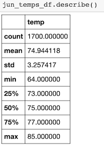
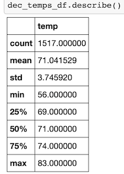

# Surfs Up Ice Cream & Surf Shop
W. Avy has asked for temperature trends in June and December to determine if the shop could be a sustainable year-round business.

### Analysis
We began by filtering the hawaii.sqlite data to extract both the June and December temperature data, and then converted each result to a DataFrame in order to run statistical analysis on it.

| June temperature data | December Temperature Data |
| :-------------: | :-----------: |
||  |

#### Analysis Take- Aways
* Oahu temperature is fairly consistent throughout the year. The quartiles for June and December are all within 4 degrees of each other, so while there is some seasonal variation in temperature, it is rather small.
* Both minimums are outside of 3 standard deviations from the average, and can likely be considered outliers- good news for ice cream.
* There is more variation in December temperatures. December has both a larger standard deviation (3.75 vs 3.26) and a larger inter-quartile range (5 vs 4).
### Summary
While there will likely be some chilly winter days where the ice cream side of the business will suffer, the temperature data suggests that the shop is viable as a year-round business. Additional analysis that looks at seasonal precipitation is advised, as rain can be more of a deterring factor than temperature. To further refine the results, you could also look at the locations of the weather stations and filter out those in the mountains, as their readings won't reflect conditions at the beach.

